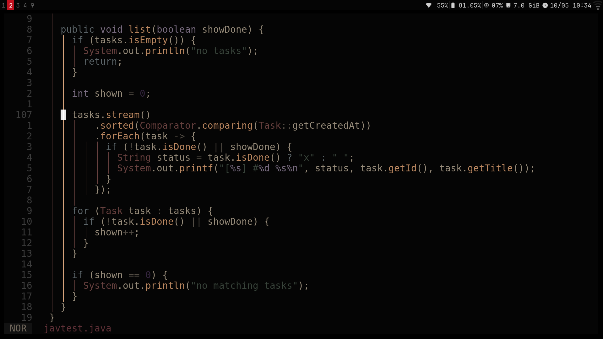
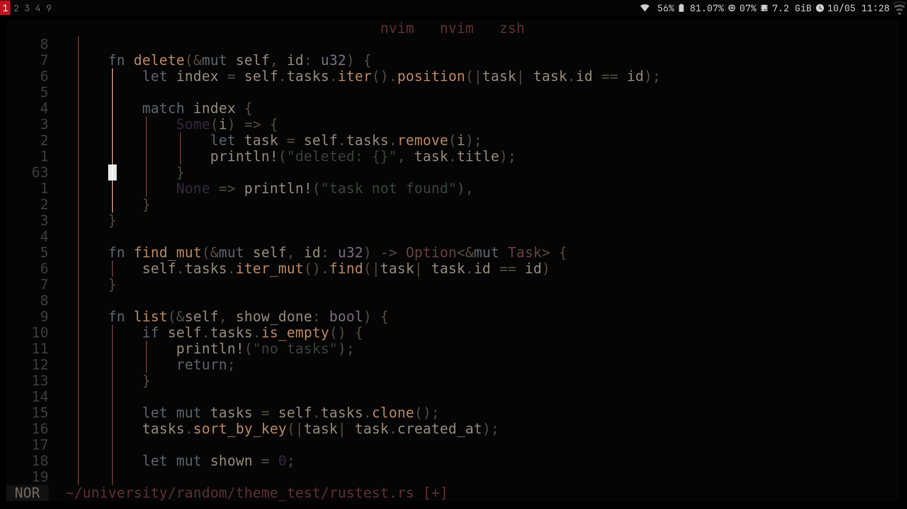
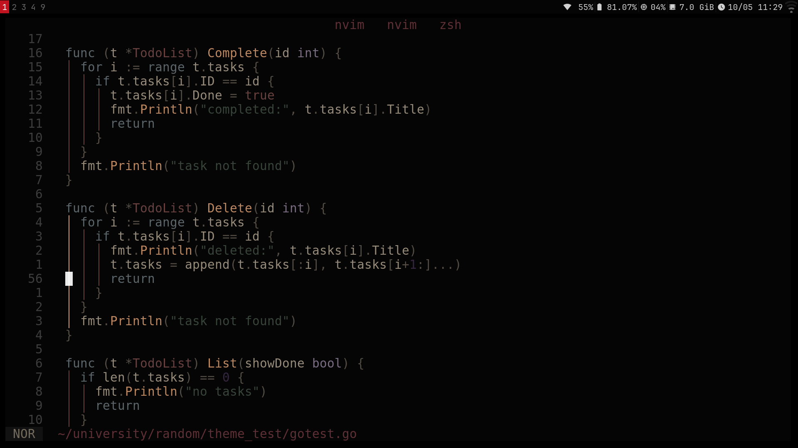
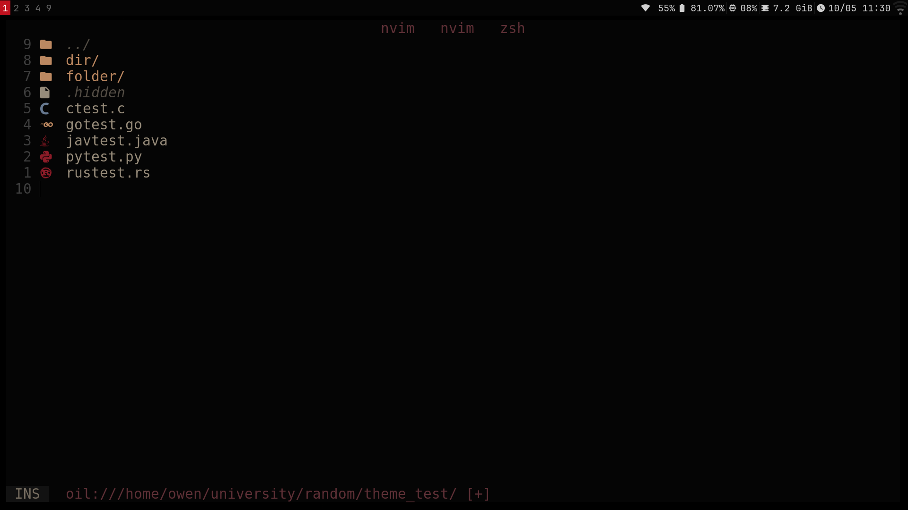

The Bean theme:

The bean theme has pastel like muddy and earthy undertones which create this dim and dusty feel.

## Features
- Dark background
- Muted syntax colours
- Treesitter support
- LSP semantic token support
- Diagnostic highlights
- Plugin highlights for snacks and indent guides





## install
Lazy.nvim:
```lua
return {
  {
    "meanybeany420/the_bean_theme.nvim",
    lazy = false,
    priority = 1000,
    config = function()
      vim.cmd.colorscheme("bean_theme")
    end,
  },
}
```
### local deployment
```lua

return {
  {
    dir = vim.fn.expand("~/bean.nvim"),
    name = "bean_theme",
    lazy = false,
    priority = 1000,
    config = function()
      vim.cmd.colorscheme("bean_theme")
    end,
  },
}
```
